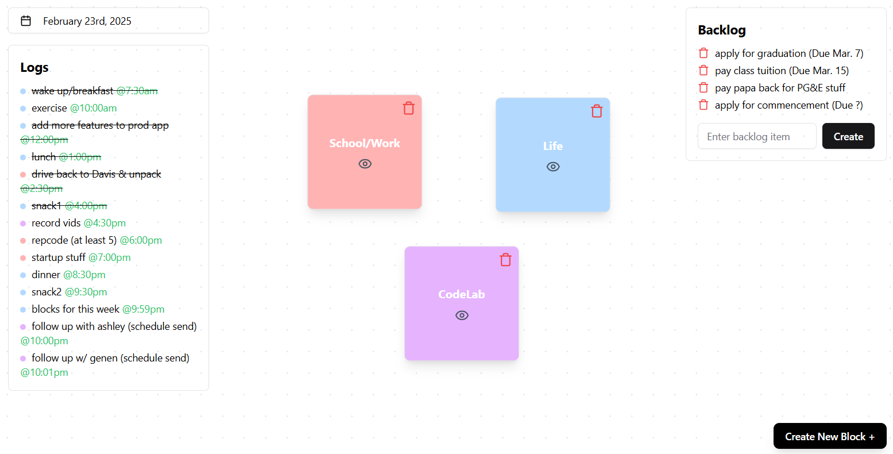

# Lazarus

Lazarus is a minimalist productivity/To Do list app that I built for myself. Google calendar is too time-based, Notion didn't have the nuance I was looking for, and various other products & websites I tried were either too bloated or too confusing (or both). So I built exactly what I was looking for, to work specifically with my brain. Maybe it'll work with yours too.

## How to Use

It's meant to be used on localhost. So simply fork or clone the repo, then run `npm run dev` in the terminal of the code editor of your choice. For it to work properly, you'll need to also create your own Supabase project and connect it by adding the `supabaseUrl` and `supabaseAnonKey` of your project to a `.env.local` file. Then you need to actually make the proper tables: this is easy, just copy/paste the contents of the "tables.txt" file in the SQL editor of Supabase and hit Run. Now you're all set! 

Hope you find it helpful! 